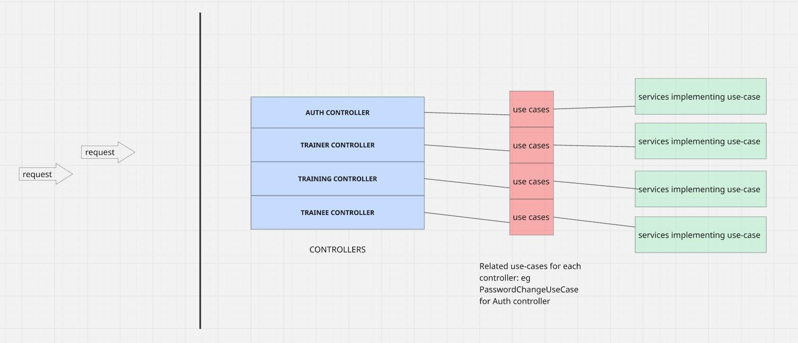

# Infrastructure: Web-Layer

```text
infrastructure/
├── config/
│   ├── AppConfig.java
│   ├── PersistenceConfig.java
│   ├── WebConfig.java                  @EnableWebMvc,Jackson(LocalDate),CORS
│   └── WebAppInitializer.java          Servlet container bootstrap
│
├── persistence/
│   ├── entity/
│   ├── mapper/
│   └── repository/
│       ├── jpa/
│       └── adapter/
│
└── web/
    ├── controller/
    │   ├── AuthController.java        Login, password change
    │   ├── TraineeController.java     Create, delete, update, activate/deactivate,get-trainings,assign trainer, get profile
    │   ├── TrainerController.java     Create, update, activate/deactivate,get trainings, get profile
    │   └── TrainingController.java    Create training, get training types
    │
    ├── dto/
    │   ├── auth/
    │   ├── trainee/
    │   ├── trainer/
    │   ├── training/
    │   └── error/
    │
    └── exception/
        └── GlobalExceptionHandler.java
```

---

# REST API Endpoint Mapping

| Operation | Endpoint | Controller | Use Case |
|----------|----------|------------|----------|
| Authenticate a user | `GET /api/auth/login` | `AuthController` | `AuthenticateUseCase` |
| Change user password | `PUT /api/auth/password` | `AuthController` | `ChangePasswordUseCase` |
| Create trainee | `POST /api/trainees` | `TraineeController` | `CreateTraineeUseCase` |
| Create trainer | `POST /api/trainers` | `TrainerController` | `CreateTrainerUseCase` |
| Delete trainee | `DELETE /api/trainees` | `TraineeController` | `DeleteTraineeUseCase` |
| Activate or deactivate trainee | `PATCH /api/trainees/activate` | `TraineeController` | `ChangeTraineeStatusUseCase` |
| Activate or deactivate trainer | `PATCH /api/trainers/activate` | `TrainerController` | `ChangeTrainerStatusUseCase` |
| Retrieve trainee trainings | `GET /api/trainees/{username}/trainings` | `TraineeController` | `RetrieveTraineeTrainingsUseCase` |
| Retrieve trainer trainings | `GET /api/trainers/{username}/trainings` | `TrainerController` | `RetrieveTrainerTrainingsUseCase` |
| Assign trainers to a trainee | `PUT /api/trainees/trainers` | `TraineeController` | `PopulateTraineeTrainersUseCase` |
| Retrieve trainee profile | `GET /api/trainees/profile` | `TraineeController` | `RetrieveTraineeUseCase` |
| Retrieve trainer profile | `GET /api/trainers/profile` | `TrainerController` | `RetrieveTrainerUseCase` |
| Update trainee profile | `PUT /api/trainees` | `TraineeController` | `UpdateTraineeUseCase` |
| Update trainer profile | `PUT /api/trainers` | `TrainerController` | `UpdateTrainerUseCase` |
| Create training | `POST /api/trainings` | `TrainingController` | `CreateTrainingUseCase` |
| Retrieve training types | `GET /api/trainings/types` | `TrainingController` | `GetTrainingTypesUseCase` |



[Endpoint Documentation (Notion)](https://app.notion.com/p/GYM-CRM-39fd31beaafb80d9b498e501d444f3d7?source=copy_link)