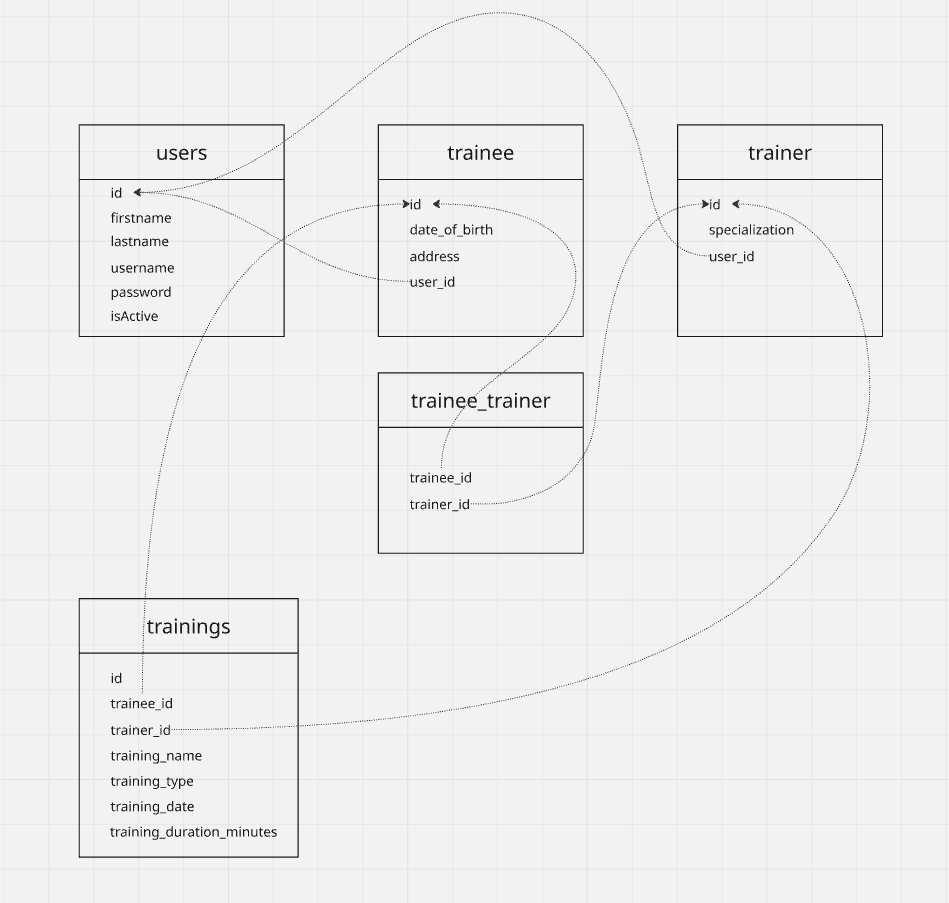

# Gym CRM — Hibernate Module Documentation

## Project Structure

```
gym-crm-hibernate/src
│
├── main/
│   └── java/com/gym/
│       │
│       ├── Main.java
│       │
│       ├── domain/
│       │   ├── User.java
│       │   ├── Training.java
│       │   ├── Trainee.java
│       │   ├── Trainer.java
│       │   └── TrainingType.java          [enum]
│       │
│       ├── application/
│       │   ├── exception/
│       │   │
│       │   ├── port/input/
│       │   │   ├── auth/
│       │   │   ├── trainee/
│       │   │   ├── trainer/
│       │   │   └── training/
│       │   │
│       │   ├── port/output/
│       │   │
│       │   ├── service/                    (UsernameGenerator, PasswordGenerator)
│       │   │
│       │   └── usecase/
│       │       ├── auth/                   (Authentication, ChangePassword)
│       │       ├── trainee/                (7 services — Create/Update/Delete/Retrieve/Status/Trainings/Trainers)
│       │       ├── trainer/                (6 services — mirrors trainee side)
│       │       └── training/               (CreateTrainingService)
│       │
│       └── infrastructure/
│           ├── config/                     (PersistenceConfig, AppConfig)
│           └── persistence/
│               ├── entity/                 (4 JPA entities)
│               ├── mapper/                 (4 domain ↔ entity mappers)
│               └── repository/
│                   ├── adapter/            (4 port implementations)
│                   └── jpa/                (4 Spring Data interfaces)
│
└── test/
    ├── auth/
    ├── trainee/
    ├── trainer/
    └── training/
```

---

## Module Descriptions

### `infrastructure.config.PersistenceConfig`
- Reads properties from `application.properties`.
- Declares beans for `DataSource`, `EntityManagerFactory`, and `TransactionManager`.

### `infrastructure.persistence.entity`
- Contains 4 JPA entity classes, which together map to 5 database tables.



### `infrastructure.persistence.mapper`
- Provides domain ↔ entity mapping.
- High-level services only work with domain objects (`User`, `Trainee`, `Trainer`, `Training`).
- Low-level persistence code only works with entity objects (`UserEntity`, `TraineeEntity`, `TrainerEntity`, `TrainingEntity`).

### `infrastructure.persistence.repository.adapter`
- Adapter classes implementing the `application.port.output` interfaces.
- Delegate to the JPA repositories described below.

### `infrastructure.persistence.repository.jpa`
- Spring Data repository interfaces.
- Some methods use JPQL for custom queries.

---

## Application Layer Responsibilities

| Package | Responsibility |
|---|---|
| `application.port.input` | Defines the use-case interfaces (contracts for each functionality) |
| `application.port.output` | Defines helper DB operation contracts (repository ports) |
| `application.usecase` | Implements the actual functionality behind each use case |

---

## Functional Requirements (16)

| # | Functionality |
|---|---|
| 1 | Register New Trainee |
| 2 | Register New Trainer |
| 3 | Authenticate User (Login) |
| 4 | Change Password |
| 5 | Retrieve Trainee Profile |
| 6 | Update Trainee Profile |
| 7 | Activate/Deactivate Trainee |
| 8 | Delete Trainee Profile |
| 9 | Retrieve Trainer Profile |
| 10 | Update Trainer Profile |
| 11 | Activate/Deactivate Trainer |
| 12 | Get Trainers Not Assigned to Trainee |
| 13 | Update Trainee's Assigned Trainers |
| 14 | Add New Training |
| 15 | Get Trainee Trainings List (with filters) |
| 16 | Get Trainer Trainings List (with filters) |