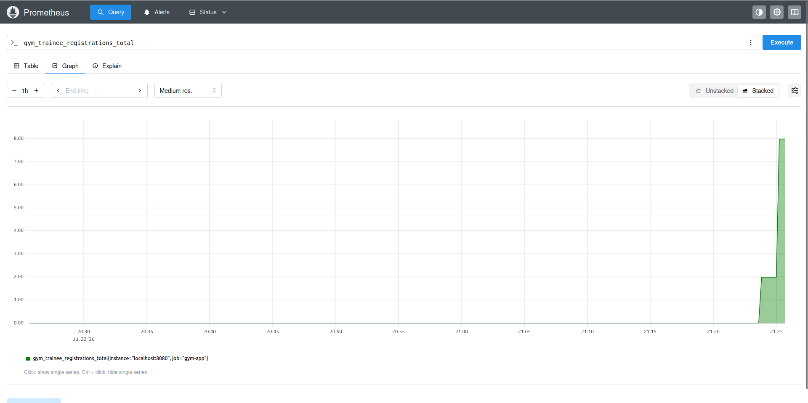

# Feature Structure

```text
monitoring/
└── prometheus.yml

src/main/java/com/gym/infrastructure/
├── actuator/
│   ├── AppEndpoint.java
│   ├── SystemResourcesEndpoint.java
│   ├── TrainingStatsEndpoint.java
│   └── UserStatsEndpoint.java
└── metrics/
    └── GymMetrics.java
```

# Implemented Features

## 1. Migrated to Spring Boot

Migrated the project from Spring Framework to Spring Boot by:

- Spring Boot parent
- Spring Boot starters
- Migrating configuration to `application.properties`

---

## 2. Added Development Profile

- Configured the `dev` Spring profile.

---

## 3. Added Swagger UI

REST API documentation:/swagger-ui/index.html

---

## 4. Configured Actuator & Prometheus

Spring Boot Actuator and Prometheus.

### Configuration

- `monitoring/prometheus.yml`

---

## 5. Custom Actuator Endpoints

Implemented four custom Actuator endpoints:

| Endpoint | Description |
|----------|-------------|
| `AppEndpoint` | Provides application information |
| `SystemResourcesEndpoint` | Displays JVM and system resource information |
| `UserStatsEndpoint` | Returns trainee and trainer statistics |
| `TrainingStatsEndpoint` | Returns training statistics |

---

## 6. Custom Prometheus Metrics

Implemented the following custom Prometheus metrics:

| Metric | Description |
|--------|-------------|
| `gym_trainee_registrations_total` | Total number of trainee registrations |
| `gym_trainer_registrations_total` | Total number of trainer registrations |
| `gym_trainings_created_total` | Total number of trainings created |
| `gym_auth_failures_total` | Total number of authentication failures |

